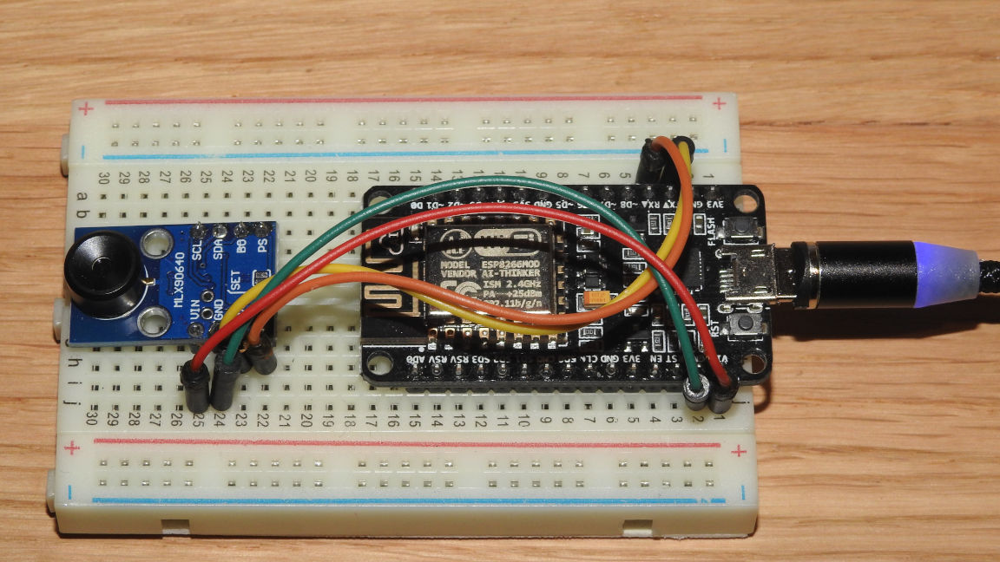

# Thermal Camera Streamer
In brief, ESP8266 streams the thermal data captured with GY-MCU90640 module to web clients.
The project is inspired by [The Easiest Thermal Camera Build You’ll Ever See](https://hackaday.com/2019/03/01/the-easiest-thermal-camera-build-youll-ever-see/).

## Features
* The 32x24 thermal frames, taken with the MLX90640 sensor, are streamed by ESP8266 to HTML5 capable web clients, where the frames are interpolated and shown on web UI;
* The frame sequence, accumulated in web browser memory, can be saved as a file for later playing back and analyzing;
* Web UI allows setting of up to 10 points for monitoring the temperature of any of the existing 768 points of the thermal picture, those points are persisted in file along with the thermal frames;
* Wi-Fi connection (e.g. AP configuring, or connecting to the existing Wi-Fi network) can be configured through the Web interface;
* Everything needed for streaming thermal data and showing it on browser is hosted on ESP8266 HTTP server locally, so no Internet required;
* There is a built-in IDE for editing the software through Web interface (useful if there is a plenty of space left on ESP flash file system);
* Up to 3 simultanious web sessions are allowed to receive a stream of thermal frames. If fourth client connects, the server removes the oldest web client recepient. *The maximum amount of simultanious client sessions may be later increased if the code is executed on more powerful NodeMCU hardware, e.g. ESP32 (not checked yet).*

### Web UI overview:

#### UI overview:

#### Setup Wi-Fi access point:

#### Setup `admin` authentication:

## BOM
* GY-MCU90640 module. The module consists of MLX90640 thermal sensor array, and STM32 microcontroller that allows communication through serial port. Please refer to [GY-MCU90640 User Manual](https://github.com/vvkuryshev/GY-MCU90640-RPI-Python/blob/master/GY_MCU9064%20user%20manual%20v1.pdf) for details.
* ESP8266 module (any board shall fit ok here, but if you are going to hack the software using built-in IDE, the board with more than 512Kb of FLASH is preferable).

## Schema
The schematic diagram can't be simpler:
* connect TX of the GY-MCU90640 to RX of the ESP8266;
* connect RX of the GY-MCU90640 to TX of the ESP8266;
* supply the power for both modules (note, that GY-MCU90640 accepts any voltage between 3V and 5V, while ESP module usually requires 3.3V).
If you use a simpler ESP module (like ESP-01), rather than ESP Dev Board (NodeMCU module), you may have to wire more ESP pins (usually CH_PD and RST must be connected to +3.3v).
Here is a prototype I used for debugging:

## Setup

1. Flash the ESP8266 module with the NodeMCU firmware. If you use older ESP module with small onboard flash (512Kb), you have to configure the NodeMCU firmware to be less than 400Kb. That is required to leave enough space (about 70Kb) on flash file system for [Thermal Streamer project files](./src). The easiest way to build smaller firmware is to use [NodeMCU custom builds](http://nodemcu-build.com/) service. When building the firmware, select **1.5.4.1-final (frozen, for 512KB flash)** branch and the following modules: `CJSON`, `encoder`, `file`, `net`, `node`, `timer`, `UART`, `WiFi`. When the service finish building the firware, it will email you with the two links to download your custom firmware (one for integer version, another for float version). Just download the **integer** version of custom firmware, check its size (395300 bytes in my case) and flash the ESP module (I used [esptool](https://github.com/espressif/esptool) for it).
2. Upload [Thermal Streamer project files](./src) to ESP flash file system (SPIFFS) using your favorite tool. For example, I used [esp-nodemcu-lua-uploader](https://github.com/dev-lab/esp-nodemcu-lua-uploader) that allows to load all the files in batch mode.
3. Restart the ESP8266 module (turn it off and turn back on). After restarting you will see a new Wi-Fi access point with the name: `esp-devlab-setup`. You will be able to connect to the module with the default password: `We1c0me!`. The default Wi-Fi AP name and password are specified in file: [`connect.lua`](./src/connect.lua).
4. On successful connection to the `esp-devlab-setup` Access Point you will be able to reach the Web UI through the browser by typing anything looking like domain name as an URL, e.g.: `any.site.my`. You can do that because the software starts a DNS liar server (it responds with the ESP8266 IP to any DNS request) in AP mode.
5. The thermal sensor module has to be initialized. For doing that, you have to navigate to Configure tab of Web UI, and press **Setup** button in **Setup the thermal sensor** section. After a couple of seconds, on successful initialization, you will see the message: *Turn-off and then turn-on the power to complete setup.*. That means that the thermal module was initialized and setting are stored in CY-MCU90640 EEPROM. After that, turn-off power supply for both modules, and then turn-on for normal use. That procedure shall be done only **once**, here is short video: [Setup the thermal sensor](https://youtu.be/Ak7GxvKt0M8).
6. Web UI shall be quite self-explaining to use. You only have to remember that the best way to brick the software is to use Web IDE without checking twice what you are uploading to the file system. The changes are taken into account immediately. A bricked NodeMCU can be cured only with connecting of ESP module to computer through UART, formatting of NodeMCU file system, and rewriting the Lua software. In some cases you even have to re-flash the NodeMCU (e.g. if you did the mistake and removed the delay in [`init.lua`](./src/init.lua).

## [License](./LICENSE)
Copyright (c) 2020 Taras Greben 

Licensed under the [Apache License](./LICENSE).
